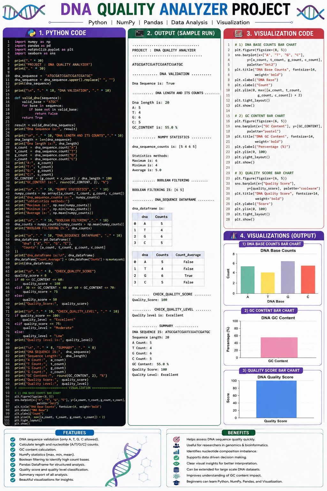

# 🧬 **DNA Quality Analyzer**

### **A Python-Based Computational Biology Project for DNA Validation, Statistical Analysis & Quality Assessment**

The **DNA Quality Analyzer** is a computational biology project developed using **Python, NumPy, Pandas, Matplotlib, and Seaborn**.

It analyzes DNA sequences by validating nucleotide bases, calculating sequence length and nucleotide composition, determining GC content, performing statistical analysis, applying Boolean filtering, creating structured DataFrames, and generating a custom DNA quality score with professional visualizations.

---

## 🔬 **Project Overview**

DNA sequence analysis is an important part of computational biology and genomics. This project demonstrates how a raw DNA sequence can be transformed into **structured biological information and numerical insights** using Python.

The analyzer follows a complete workflow:

```text
DNA Sequence
      ↓
Sequence Cleaning
      ↓
DNA Validation
      ↓
Sequence Length
      ↓
Nucleotide Counts
      ↓
GC Content
      ↓
NumPy Statistics
      ↓
Boolean Filtering
      ↓
Pandas DataFrame
      ↓
Quality Score
      ↓
Quality Level
      ↓
Visualizations
      ↓
Final Summary
```

---

## 🚀 **Key Features**

* 🧬 **DNA Sequence Validation**
* 🧹 **Sequence Cleaning**
* 📏 **DNA Length Calculation**
* 🔢 **A / T / G / C Nucleotide Counting**
* 🧪 **GC Content Analysis**
* 📊 **NumPy Statistical Analysis**
* 🔎 **Boolean Masking & Filtering**
* 🗂️ **Pandas DataFrame Analysis**
* 🎯 **Custom DNA Quality Score**
* ⭐ **Quality Level Classification**
* 📋 **Automated Summary Report**
* 📈 **Professional Data Visualizations**

---

## 🛠️ **Technologies & Libraries**

| Technology        | Purpose                                    |
| ----------------- | ------------------------------------------ |
| 🐍 **Python**     | Core programming and biological analysis   |
| 🔢 **NumPy**      | Numerical operations and statistics        |
| 🐼 **Pandas**     | DataFrames and structured analysis         |
| 📊 **Matplotlib** | Data visualization                         |
| 🎨 **Seaborn**    | Statistical and professional visualization |

---

## 🧬 **DNA Analysis Performed**

### **1. DNA Validation**

The analyzer checks whether every character in the sequence belongs to the four standard DNA bases:

```text
A → Adenine
T → Thymine
G → Guanine
C → Cytosine
```

The validation function returns:

```text
True  → Valid DNA Sequence
False → Invalid DNA Sequence
```

---

### **2. DNA Length & Nucleotide Counts**

The program calculates:

* Total DNA sequence length
* Number of **A**
* Number of **T**
* Number of **G**
* Number of **C**

This provides a basic nucleotide composition profile.

---

### **3. GC Content**

GC content is calculated using:

```python
GC_CONTENT = (g_count + c_count) / dna_length * 100
```

The result is displayed as a percentage.

---

## 📊 **NumPy Statistical Analysis**

NumPy is used to analyze nucleotide counts through statistical methods:

```python
np.max(numpy_counts)
np.min(numpy_counts)
np.mean(numpy_counts)
```

### **Statistics Included**

* **Maximum Count**
* **Minimum Count**
* **Average Count**

This demonstrates the practical use of numerical statistics in biological data analysis.

---

## 🔎 **Boolean Filtering**

The project applies a NumPy Boolean mask to identify nucleotide counts that are greater than the average:

```python
numpy_counts[numpy_counts > np.mean(numpy_counts)]
```

This demonstrates how biological numerical data can be filtered using conditions.

---

## 🗂️ **Pandas DataFrame Analysis**

The nucleotide information is converted into a structured DataFrame:

| DNA Base | Count | Above Average |
| -------- | ----: | ------------- |
| A        | Count | True / False  |
| T        | Count | True / False  |
| G        | Count | True / False  |
| C        | Count | True / False  |

This makes the biological data easier to inspect, analyze, and visualize.

---

## 🎯 **DNA Quality Score**

The project uses a **custom educational scoring system** based on GC content.

| GC Content                | Score | Quality Level |
| ------------------------- | ----: | ------------- |
| **40–60%**                |   100 | 🟢 Excellent  |
| **30–39.99% / 60.01–70%** |    75 | 🟡 Moderate   |
| **Other ranges**          |    50 | 🔴 Low        |

> ⚠️ **Important:** This is a project-defined educational scoring system and should not be interpreted as a universal biological or clinical DNA quality standard.

---

# 📈 **Visualization & Data Insights**

The project includes **three visualizations** generated using **Matplotlib and Seaborn**.

### **1️⃣ DNA Base Counts**

Compares the number of:

**A | T | G | C**

This makes nucleotide composition easy to understand visually.

### **2️⃣ DNA GC Content**

Displays the calculated GC content as a percentage.

### **3️⃣ DNA Quality Score**

Displays the final quality score generated by the analyzer.

---

## 🖼️ **DNA Quality Analyzer — Complete Project Visualization**



**The visualization image contains:**

* 🐍 Complete Python code
* 💻 Sample program output
* 🧬 DNA analysis results
* 📊 DNA base-count chart
* 🧪 GC-content chart
* 🎯 Quality-score chart
* ⭐ Project features and benefits

---

## 📋 **Example Output**

For the example sequence:

```text
ATGCGATCGATCGATCGATGC
```

The analyzer produces results similar to:

```text
DNA Sequence is: True

DNA Length: 21

A Count: 5
T Count: 4
G Count: 6
C Count: 6

GC Content: 57.14 %

Maximum: 6
Minimum: 4
Average: 5.25

Quality Score: 100
Quality Level: Excellent
```

> The exact results change automatically when a different DNA sequence is provided.

---

# 💡 **Project Benefits**

### 🧬 **Computational Biology Practice**

Demonstrates how programming can be applied to real biological sequence data.

### 📊 **Data Analysis Skills**

Combines NumPy and Pandas to convert biological information into structured numerical data.

### 📈 **Visual Interpretation**

Transforms nucleotide counts, GC content, and quality scores into easy-to-understand charts.

### 🧠 **Programming Logic**

Practices functions, loops, conditions, Boolean logic, arrays, and DataFrames in one project.

### 🚀 **Foundation for Advanced Projects**

The analyzer can later be extended toward:

* Sequence comparison
* Mutation detection
* SNP analysis
* FASTA processing
* Multiple sequence analysis
* Genomic datasets
* Machine Learning applications

---

## 🧠 **Python & Biology Concepts Demonstrated**

```text
Python Variables
Strings
String Methods
Functions
For Loops
If / Elif / Else
Boolean Logic
NumPy Arrays
NumPy Statistics
Boolean Masking
Pandas DataFrames
Data Analysis
Matplotlib
Seaborn
DNA Sequence Analysis
GC Content
Computational Biology
```

---

## 📁 **Project Structure**

```text
DNA-Quality-Analyzer/
│
├── DNA_Quality_Analyzer.py
├── README.md
├── dna_quality_analyzer.png
└── requirements.txt
```

---

## 📦 **Required Libraries**

Create a `requirements.txt` file containing:

```text
numpy
pandas
matplotlib
seaborn
```

Install them with:

```bash
pip install -r requirements.txt
```

---

## ▶️ **How to Run**

### **Step 1 — Clone the Repository**

```bash
git clone YOUR_GITHUB_REPOSITORY_URL
```

### **Step 2 — Open the Project**

```bash
cd DNA-Quality-Analyzer
```

### **Step 3 — Install Requirements**

```bash
pip install -r requirements.txt
```

### **Step 4 — Run the Analyzer**

```bash
python DNA_Quality_Analyzer.py
```

---

# 🔮 **Future Improvements**

The project can be further developed by adding:

* 📂 FASTA file input
* 📊 CSV dataset support
* 🧬 Multiple DNA sequence analysis
* 🔬 Sequence comparison
* 🧪 Mutation & SNP detection
* 📈 Advanced GC-content analysis
* 🤖 Machine Learning-based quality prediction
* 🌐 Interactive web dashboard
* 📋 Automated biological reports

---

# 👨‍💻 **Author**

## **Muhammad Maaz**

### 🧬 **Coding With Maazi**

**Python • Data Science • Computational Biology • Machine Learning**

> *Building practical projects while learning Computational Biology and Data Science.*

---

# ⭐ **Project Goal**

The main goal of the **DNA Quality Analyzer** is to demonstrate how:

**Biological Knowledge + Python Programming + Data Analysis + Visualization**

can be combined to create practical **Computational Biology applications**.

This project represents a foundation for moving from basic DNA sequence analysis toward more advanced **genomic data analysis and computational biology workflows**.

---

## ⭐ **If You Like This Project**

If this project helped you learn something useful, consider giving the repository a ⭐ and following the project for future Computational Biology projects.

**#Python #ComputationalBiology #DNA #Bioinformatics #NumPy #Pandas #DataScience #DataVisualization #Seaborn #Matplotlib**

